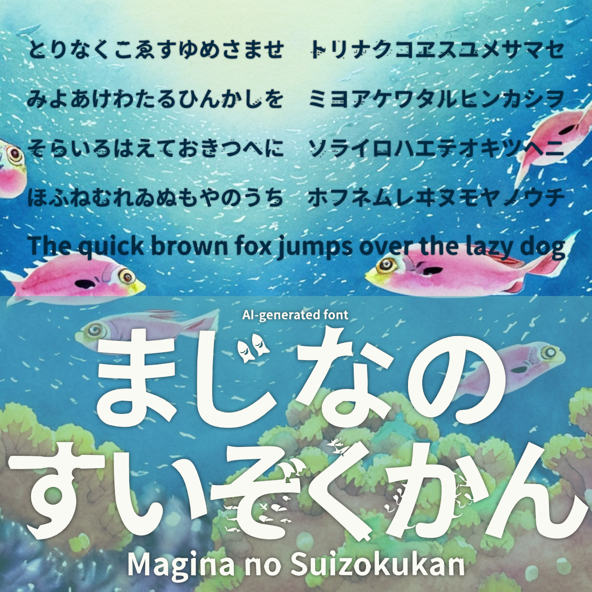
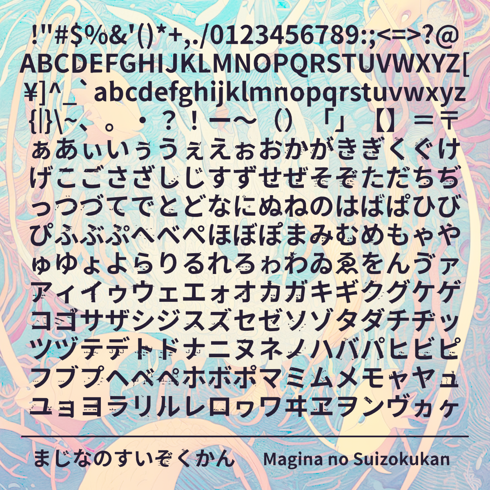

# まじなのすいぞくかん

## フォントについて

- このフォントはAIで生成した画像から作成しました。
- 源ノ角ゴシックのグリフをStable Diffusionのimg2imgに入力し、生成された画像をフォントデータに変換しています。

## 配布ファイル

- MaginaNoSuizokukan-Regular.otf

## ライセンス

[SIL Open Font License Version 1.1](https://scripts.sil.org/cms/scripts/page.php?site_id=nrsi&id=OFL_web)

## 収録字種

!"#$%&'()*+,./0123456789:;<=>?@ABCDEFGHIJKLMNOPQRSTUVWXYZ[¥]^_`abcdefghijklmnopqrstuvwxyz{|}\~、。・？！ー～（）「」【】＝〒ぁあぃいぅうぇえぉおかがきぎくぐけげこごさざしじすずせぜそぞただちぢっつづてでとどなにぬねのはばぱひびぴふぶぷへべぺほぼぽまみむめもゃやゅゆょよらりるれろゎわゐゑをんゔァアィイゥウェエォオカガキギクグケゲコゴサザシジスズセゼソゾタダチヂッツヅテデトドナニヌネノハバパヒビピフブプヘベペホボポマミムメモャヤュユョヨラリルレロヮワヰヱヲンヴヵヶ

## 学習元のグリフ

- [源ノ角ゴシック JP V2.001 Bold](https://github.com/adobe-fonts/source-han-sans/tree/release)

## 学習モデルとプロンプト

- model
  - [Stable Diffusion v2.0](https://github.com/Stability-AI/stablediffusion)
- prompt
  - A logo of school of fish and waves, sea animals
- negative prompt
  - error, signature, cropped, username, low quality, text, watermark, blurry, missing fingers, no background
- settings
  - Steps: 30, Sampler: DPM++ 2M, CFG scale: 8, SSize: 512x512, Denoising strength: 0.65, Mask blur: 4

## 注意事項

- 本フォントを利用したことによって発生したいかなる故障・損害についても責任を負いません。
- 機械的に処理している関係上、パスが崩れたグリフや空白になっているグリフが存在する可能性があります。あらかじめご了承ください。

## 作者

- あまずさ鴒 (Amazusa Rei)
  - E-Mail: amazusa0@gmail.com
  - Twitter: @AmazusaRei
  - GitHub: https://github.com/amazusa

## 更新履歴

- 2023/01/06  まじなのすいぞくかん ver1.0 公開

---

## Brief description in English

### About this font

- This font (MaginaNoSuizokukan) is created with AI-generated images generated by img2img based on Source Han Sans.
  
### License

- This Software is licensed under the SIL Open Font License, Version 1.1.

### Caution

- We are not responsible for any malfunction or damage caused by the use of this font.

### Author

- Amazusa Rei
  - E-Mail: amazusa0@gmail.com
  - Twitter: @AmazusaRei
  - GitHub: https://github.com/amazusa
