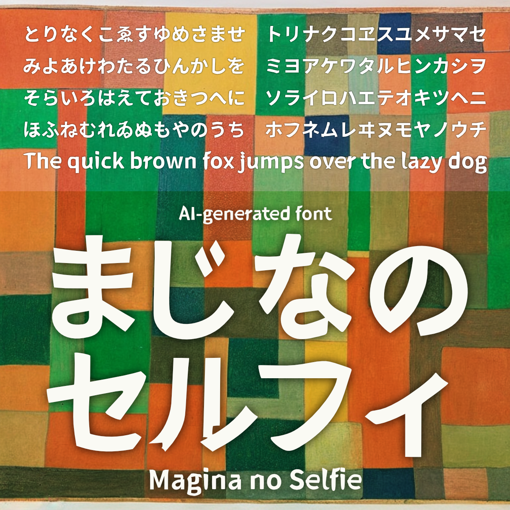
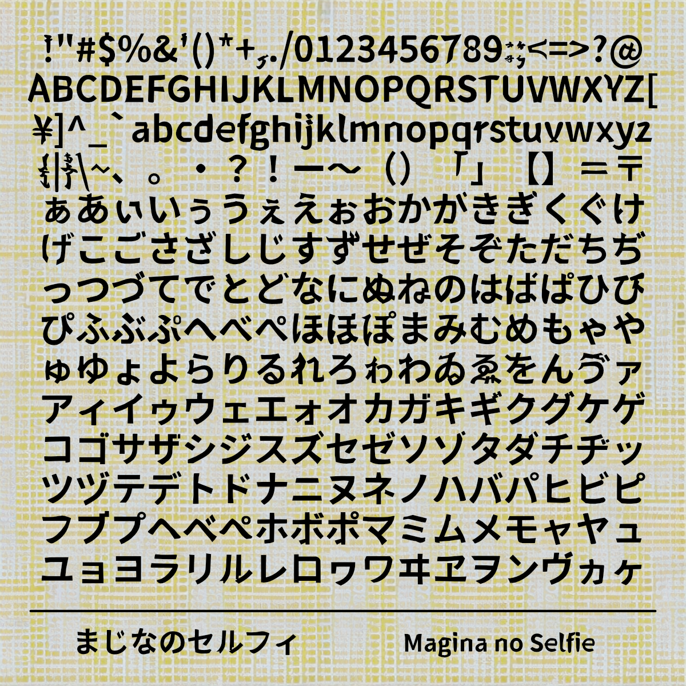
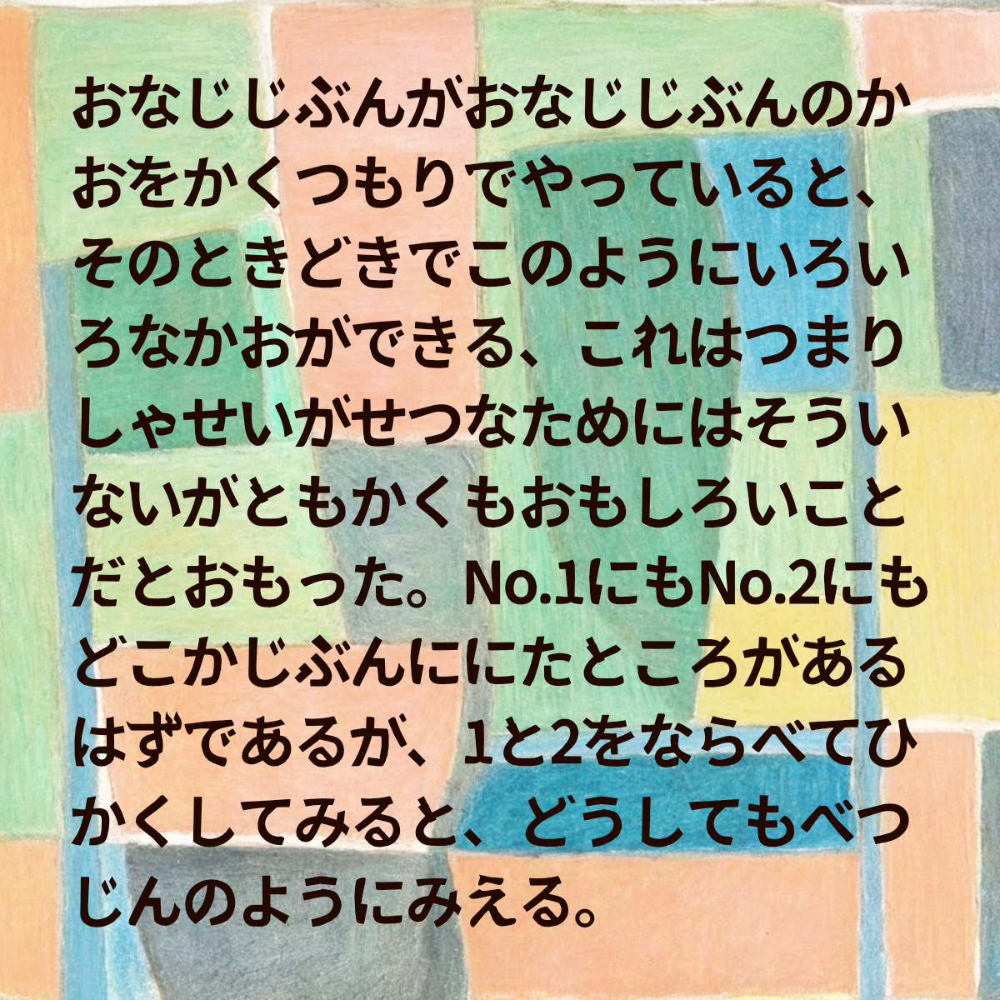
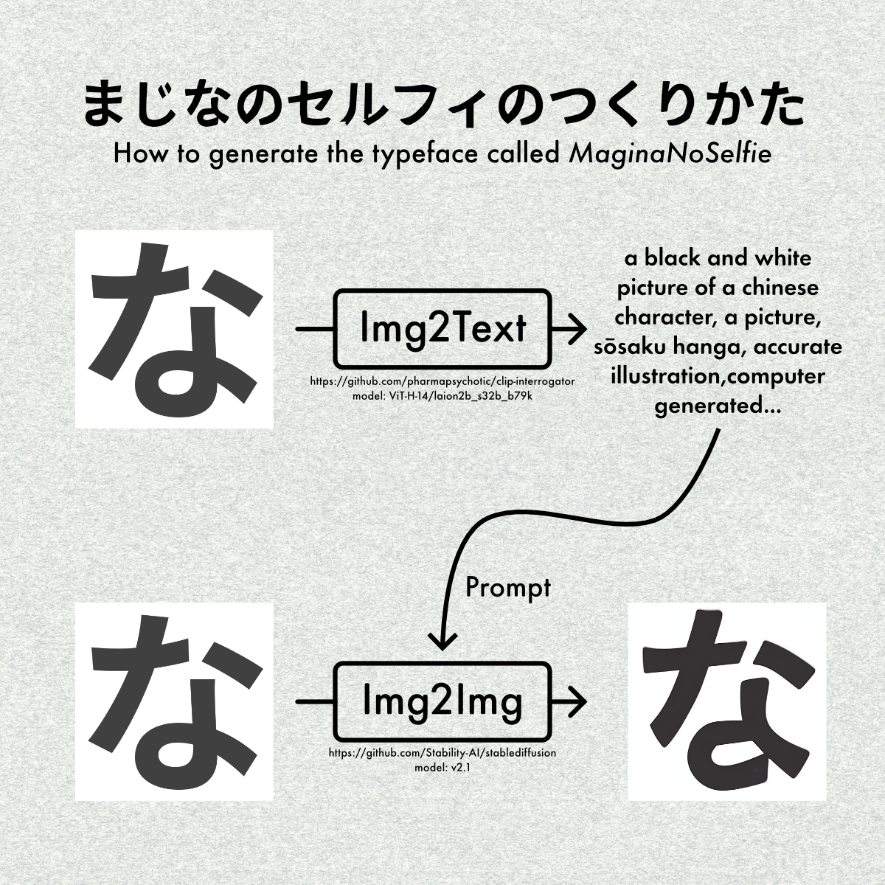

# まじなのセルフィ



## 概要

- このフォントはAIで生成した画像から作成しました。
- 源ノ角ゴシックのグリフをStable Diffusionのimg2imgに入力し、生成された画像をフォントデータに変換しています。
- 本フォントは、以下の手順で作成しました。
  1. 源ノ角ゴシックBoldの「な」の字を Img2Textに入力してプロンプトを生成しました。
  2. 先の手順のプロンプトで、源ノ角ゴシックBoldの各文字についてImg2imgを実行することで、本フォントの各文字の画像を生成しました。

## ライセンス

[SIL Open Font License Version 1.1](https://scripts.sil.org/cms/scripts/page.php?site_id=nrsi&id=OFL_web)

## 収録字種

- ひらがな
- カタカナ
- Alphabet
- 半角数字
- 記号、約物類の一部

```
!"#$%&'()*+,./0123456789:;<=>?@ABCDEFGHIJKLMNOPQRSTUVWXYZ[¥]^_`abcdefghijklmnopqrstuvwxyz{|}\~、。・？！ー～（）「」【】＝〒ぁあぃいぅうぇえぉおかがきぎくぐけげこごさざしじすずせぜそぞただちぢっつづてでとどなにぬねのはばぱひびぴふぶぷへべぺほぼぽまみむめもゃやゅゆょよらりるれろゎわゐゑをんゔァアィイゥウェエォオカガキギクグケゲコゴサザシジスズセゼソゾタダチヂッツヅテデトドナニヌネノハバパヒビピフブプヘベペホボポマミムメモャヤュユョヨラリルレロヮワヰヱヲンヴヵヶ
```

## サンプル






## 学習元のグリフ

- [源ノ角ゴシック JP V2.001 Bold](https://github.com/adobe-fonts/source-han-sans/tree/release)

## 学習モデルとプロンプト

- model
  - [Stable Diffusion v2.1](https://github.com/Stability-AI/stablediffusion)
- prompt
  - a black and white picture of a chinese character, a picture, sōsaku hanga, accurate illustration, computer generated, reisen udongein inaba, close up high detailed, high quality upload, devastated, full res, tourist photo, logotype, higher detailed illustration
  - (Negative Prompt) worst quality, low quality, normal quality, jpeg artifacts,  error, cropped, signature, username, text, watermark
  - プロンプトは以下のmodelで生成しました。
    - https://github.com/pharmapsychotic/clip-interrogator (model: ViT-H-14/laion2b_s32b_b79k)

## 注意事項

- 本フォントを利用したことによって発生したいかなる故障・損害についても責任を負いません。
- 機械的に処理している関係上、パスが崩れたグリフや空白になっているグリフが存在する可能性があります。あらかじめご了承ください。

## 作者

- あまずさ鴒 (Amazusa Rei)
  - E-Mail: amazusa0@gmail.com
  - Twitter: @AmazusaRei
  - GitHub: <https://github.com/amazusa>

## 更新履歴

- 2023/02/22  まじなのセルフィ ver1.0 公開

---

## Brief description in English

### About this font

- This font (MaginaNoSelfie) is created with AI-generated images generated by img2img based on Source Han Sans.
  
### License

- This Software is licensed under the SIL Open Font License, Version 1.1.

### Caution

- We are not responsible for any malfunction or damage caused by the use of this font.

### Author

- Amazusa Rei
  - E-Mail: amazusa0@gmail.com
  - Twitter: @AmazusaRei
  - GitHub: <https://github.com/amazusa>
